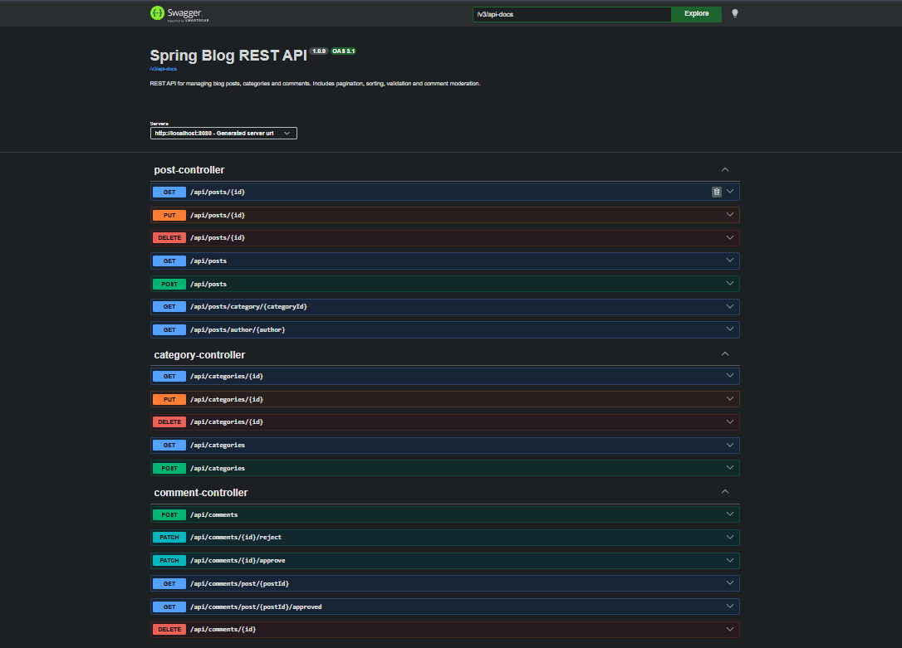
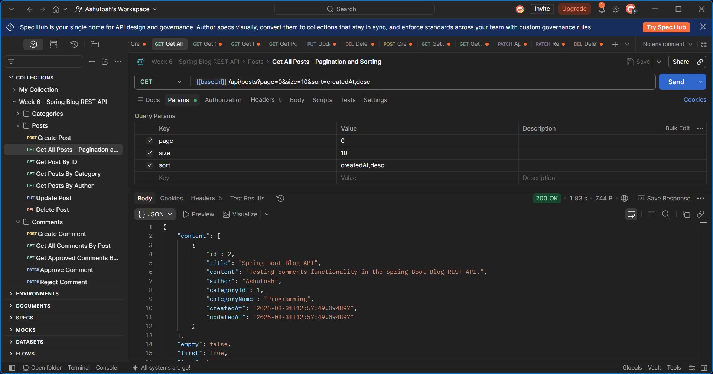
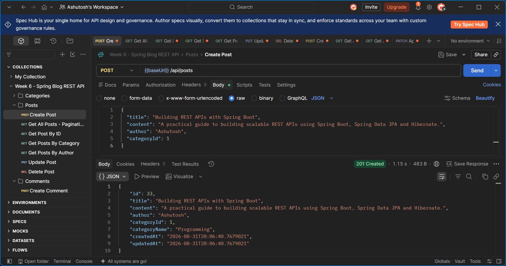
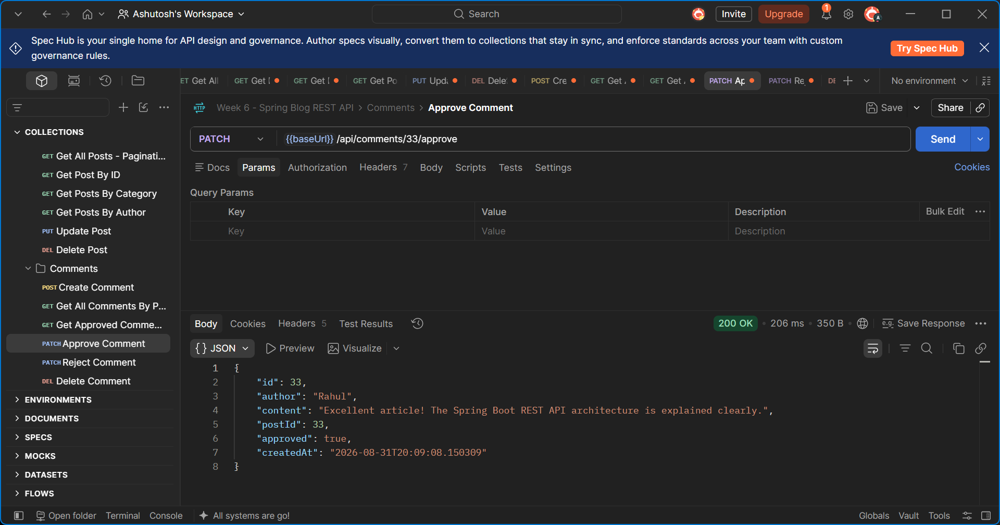
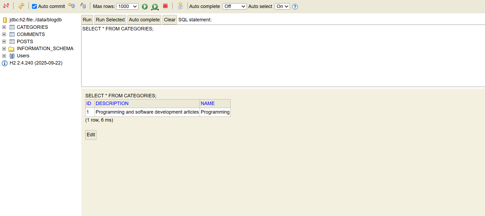
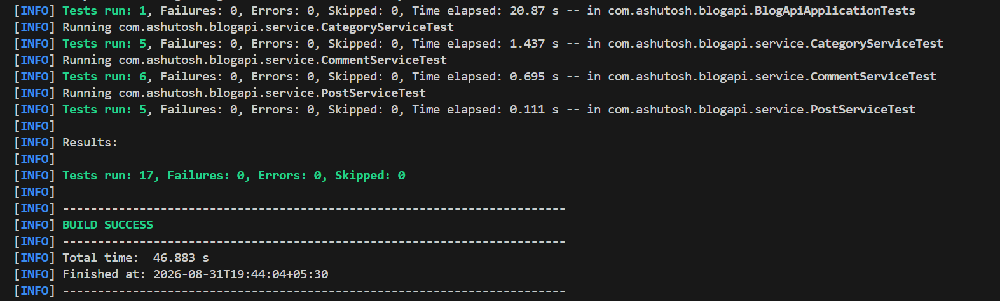

Spring Blog REST API

  <strong>A production-ready RESTful Blog Management API built with Java 21 and Spring Boot</strong>

  Posts • Categories • Comments • Pagination • Validation • Moderation • Swagger • Automated Testing

  
  
  
  
  
  
  

🌐 Live Production API

The application is deployed on Render and connected to a PostgreSQL production database.

<table>
  <tr>
    <th>Resource</th>
    <th>Link</th>
  </tr>
  <tr>
    <td>🚀 Live API</td>
    <td><a href="https://week6-spring-blog-api.onrender.com/api/posts">Open Production API</a></td>
  </tr>
  <tr>
    <td>📘 Swagger UI</td>
    <td><a href="https://week6-spring-blog-api.onrender.com/swagger-ui/index.html">Open Interactive API Docs</a></td>
  </tr>
  <tr>
    <td>📄 OpenAPI JSON</td>
    <td><a href="https://week6-spring-blog-api.onrender.com/v3/api-docs">View OpenAPI Specification</a></td>
  </tr>
  <tr>
    <td>💻 GitHub Repository</td>
    <td><a href="https://github.com/Ashutosh9-pan/week6-spring-blog-api">View Source Code</a></td>
  </tr>
</table>

Render Free Tier: The service may spin down after inactivity, so the first request can take around 50 seconds or more.

📌 Overview

Spring Blog REST API is a backend application for managing blog content through RESTful endpoints.

The project demonstrates a clean layered Spring Boot architecture with support for:

Blog posts

Categories

Comments and moderation

CRUD operations

Pagination and sorting

Filtering by category and author

DTO-based API models

Request validation

Global exception handling

Transaction management

H2 development database

PostgreSQL production database and cloud deployment

Swagger/OpenAPI documentation

JUnit 5 and Mockito testing

Postman API testing

API Documentation Preview

The complete REST API is documented through Swagger/OpenAPI.

  

Swagger exposes endpoints for Posts, Categories and Comments from a single interactive interface.

🛠️ Tech Stack

| Technology | Usage |

|---|---|

| Java 21 | Programming language |

| Spring Boot 4.0.8 | Backend framework |

| Spring Web | REST API development |

| Spring Data JPA | Repository and persistence layer |

| Hibernate | Object-relational mapping |

| Jakarta Validation | Request validation |

| H2 Database | Development database |

| PostgreSQL | Production database |
| Render | Cloud deployment |

| Springdoc OpenAPI | Swagger/OpenAPI documentation |

| JUnit 5 | Automated testing |

| Mockito | Service-layer unit testing |

| Maven | Build and dependency management |

| Postman | Manual API testing |

🏗️ Architecture

The project follows a layered architecture to separate HTTP handling, business logic and persistence.

Client / Postman / Swagger

           |

           v

     Controller Layer

           |

           v

       DTO Models

           |

           v

      Service Layer

           |

           v

     Repository Layer

           |

           v

    JPA / Hibernate ORM

           |

           v

        Database

     H2 / PostgreSQL

Controller Layer

Handles REST requests, validation and HTTP responses.

Service Layer

Contains business logic and transaction management.

Repository Layer

Uses Spring Data JPA to interact with the database.

DTO Layer

Separates external API request/response models from persistence entities.

Exception Layer

Provides centralized error responses using @RestControllerAdvice.

📁 Project Structure

week6-spring-blog-api/

|

├── docs/

│   ├── postman_collection.json

│   └── screenshots/

│       ├── swagger-ui.png

│       ├── h2-console.png

│       ├── postman-pagination.png

│       ├── postman-create-post.png

│       ├── comment-moderation.png

│       └── test-success.png

|

├── src/

│   ├── main/

│   │   ├── java/com/ashutosh/blogapi/

│   │   │   ├── config/

│   │   │   │   └── SwaggerConfig.java

│   │   │   ├── controller/

│   │   │   │   ├── CategoryController.java

│   │   │   │   ├── CommentController.java

│   │   │   │   └── PostController.java

│   │   │   ├── dto/

│   │   │   │   ├── CommentRequest.java

│   │   │   │   ├── CommentResponse.java

│   │   │   │   ├── PostRequest.java

│   │   │   │   └── PostResponse.java

│   │   │   ├── entity/

│   │   │   │   ├── Category.java

│   │   │   │   ├── Comment.java

│   │   │   │   └── Post.java

│   │   │   ├── exception/

│   │   │   │   ├── DuplicateResourceException.java

│   │   │   │   ├── GlobalExceptionHandler.java

│   │   │   │   └── ResourceNotFoundException.java

│   │   │   ├── repository/

│   │   │   │   ├── CategoryRepository.java

│   │   │   │   ├── CommentRepository.java

│   │   │   │   └── PostRepository.java

│   │   │   ├── service/

│   │   │   │   ├── CategoryService.java

│   │   │   │   ├── CommentService.java

│   │   │   │   └── PostService.java

│   │   │   └── BlogApiApplication.java

│   │   └── resources/

│   │       ├── application.properties

│   │       ├── application-dev.properties

│   │       └── application-prod.properties

│   └── test/

│       ├── java/com/ashutosh/blogapi/

│       │   ├── service/

│       │   │   ├── CategoryServiceTest.java

│       │   │   ├── CommentServiceTest.java

│       │   │   └── PostServiceTest.java

│       │   └── BlogApiApplicationTests.java

│       └── resources/

│           └── application-dev.properties

|

├── .gitignore

├── pom.xml

└── README.md

🔌 API Endpoints

Categories

| Method | Endpoint | Description |

|---|---|---|

| POST | /api/categories | Create a category |

| GET | /api/categories | Get all categories |

| GET | /api/categories/{id} | Get category by ID |

| PUT | /api/categories/{id} | Update category |

| DELETE | /api/categories/{id} | Delete category |

Posts

| Method | Endpoint | Description |

|---|---|---|

| POST | /api/posts | Create a post |

| GET | /api/posts | Get posts with pagination and sorting |

| GET | /api/posts/{id} | Get post by ID |

| GET | /api/posts/category/{categoryId} | Filter posts by category |

| GET | /api/posts/author/{author} | Filter posts by author |

| PUT | /api/posts/{id} | Update post |

| DELETE | /api/posts/{id} | Delete post |

Comments

| Method | Endpoint | Description |

|---|---|---|

| POST | /api/comments | Create a comment |

| GET | /api/comments/post/{postId} | Get comments for a post |

| GET | /api/comments/post/{postId}/approved | Get approved comments |

| PATCH | /api/comments/{id}/approve | Approve a comment |

| PATCH | /api/comments/{id}/reject | Reject a comment |

| DELETE | /api/comments/{id} | Delete a comment |

Pagination and Sorting

The Posts API supports Spring Data pagination and sorting.

Example:

GET /api/posts?page=0&size=10&sort=createdAt,desc

Parameters:

| Parameter | Description | Example |

|---|---|---|

| page | Page number | 0 |

| size | Number of records per page | 10 |

| sort | Property and direction | createdAt,desc |

Postman Result

  

The response demonstrates successful pagination and sorting with an HTTP 200 OK response.

Creating a Blog Post

Example request:

{

  "title": "Building REST APIs with Spring Boot",

  "content": "A practical guide to building scalable REST APIs using Spring Boot, Spring Data JPA and Hibernate.",

  "author": "Ashutosh",

  "categoryId": 1

}

A successfully created resource returns:

HTTP 201 Created

Postman — Create Post

  

Comment Moderation

Comments are initially created in an unapproved state.

{

  "approved": false

}

A comment can then be approved through:

PATCH /api/comments/{id}/approve

or rejected through:

PATCH /api/comments/{id}/reject

Approved Comment

  

The moderation endpoint returns the updated comment with:

{

  "approved": true

}

Request Validation

Jakarta Bean Validation is used to validate incoming requests.

Validation includes:

Required category name

Category name length

Required post title and content

Required post author

Required category ID

Comment author validation

Comment content validation

Required post ID

Invalid input returns:

400 Bad Request

with structured field-level validation errors.

Exception Handling

Centralized exception handling is implemented with:

@RestControllerAdvice

| Scenario | HTTP Status |

|---|---|

| Validation failure | 400 Bad Request |

| Resource not found | 404 Not Found |

| Duplicate resource | 409 Conflict |

| Unexpected server error | 500 Internal Server Error |

Database Configuration

Development — H2

The development profile uses a persistent file-based H2 database:

spring.datasource.url=jdbc:h2:file:./data/blogdb

spring.datasource.username=sa

spring.datasource.password=

H2 Console:

http://localhost:8080/h2-console

Connection settings:

JDBC URL: jdbc:h2:file:./data/blogdb

Username: sa

Password: leave blank

Database Verification

  

The application maintains separate CATEGORIES, POSTS, and COMMENTS tables through JPA/Hibernate.

Production — PostgreSQL

The production profile is configured to obtain database credentials from environment variables:

spring.datasource.url=${DB_URL}

spring.datasource.username=${DB_USERNAME}

spring.datasource.password=${DB_PASSWORD}

Required environment variables:

DB_URL

DB_USERNAME

DB_PASSWORD

This keeps production credentials outside the source code and repository.

Production Deployment

The production API is deployed on Render with the prod Spring profile and PostgreSQL environment variables configured securely in the hosting environment.

Live API: https://week6-spring-blog-api.onrender.com
Swagger UI: https://week6-spring-blog-api.onrender.com/swagger-ui/index.html
OpenAPI: https://week6-spring-blog-api.onrender.com/v3/api-docs

Production deployment has been verified by successfully creating categories, posts, and comments and by approving comments through the live Swagger UI.

Swagger / OpenAPI

Start the application and visit:

http://localhost:8080/swagger-ui/index.html

OpenAPI specification:

http://localhost:8080/v3/api-docs

Swagger provides interactive documentation for all Posts, Categories and Comments endpoints.

Postman Collection

A ready-to-import Postman collection is included in:

docs/postman_collection.json

It contains requests for:

Category CRUD

Post CRUD

Pagination and sorting

Filtering posts by category

Filtering posts by author

Comment creation

Approved comment retrieval

Comment approval and rejection

Comment deletion

Default API base URL:

http://localhost:8080

🧪 Automated Testing

The project contains automated tests using:

JUnit 5

Mockito

Spring Boot Test

In-memory H2 test database

Run the complete test suite:

mvn clean test

Test Results

Tests run: 17

Failures: 0

Errors: 0

Skipped: 0

BUILD SUCCESS

  

Test coverage includes:

Application context loading

Category service business logic

Post service business logic

Comment service business logic

Repository dependency mocking

Successful operations

Resource-not-found scenarios

Duplicate-resource scenarios

🚀 Getting Started

Prerequisites

Install:

Java 21 or newer

Apache Maven

Git

Verify:

java -version

mvn -version

git --version

Clone the Repository

git clone https://github.com/Ashutosh9-pan/week6-spring-blog-api.git

cd week6-spring-blog-api

Run the Application

mvn spring-boot:run

The API starts at:

http://localhost:8080

Development and Production Profiles

The default configuration activates the development profile:

spring.profiles.active=dev

Development uses H2.

For production, activate the prod profile and provide the required PostgreSQL environment variables.

Example:

mvn spring-boot:run -Dspring-boot.run.profiles=prod

HTTP Status Codes

| Status | Meaning |

|---|---|

| 200 OK | Successful GET, PUT or PATCH request |

| 201 Created | Resource successfully created |

| 204 No Content | Resource successfully deleted |

| 400 Bad Request | Request validation failed |

| 404 Not Found | Resource does not exist |

| 409 Conflict | Duplicate resource |

| 500 Internal Server Error | Unexpected server error |

Key Engineering Concepts Demonstrated

This project demonstrates practical backend development concepts including:

RESTful API design

Layered architecture

Dependency injection

DTO pattern

ORM and entity relationships

Repository pattern

Transaction management

Pagination and sorting

Request validation

Centralized exception handling

Environment-based configuration

API documentation

Unit testing and mocking

Development and production database profiles

Project Verification

| Component | Status |

|---|---|

| Category CRUD | ✅ Working |

| Post CRUD | ✅ Working |

| Comment APIs | ✅ Working |

| Pagination & Sorting | ✅ Working |

| Category Filtering | ✅ Working |

| Author Filtering | ✅ Working |

| Comment Moderation | ✅ Working |

| Validation | ✅ Working |

| Exception Handling | ✅ Working |

| H2 Development DB | ✅ Working |

| PostgreSQL Production DB | ✅ Connected |
| Render Production Deployment | ✅ Live |

| Swagger/OpenAPI | ✅ Working locally & in production |

| Postman Collection | ✅ Included |

| Automated Tests | ✅ 17/17 Passed |

👨‍💻 Author

Ashutosh Panwar

B.Tech Computer Science & Engineering

✅ Project Status

Completed — Week 6 Spring Boot Blog REST API

The Week 6 project has been implemented, tested, documented and deployed to production with Render and PostgreSQL.